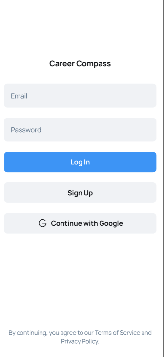
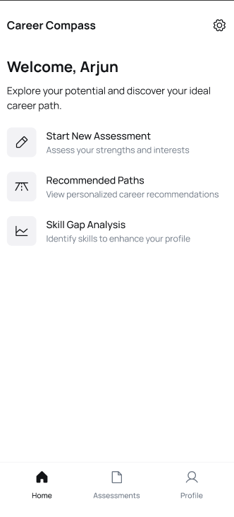

# 🎯 Career Compass - AI-Powered Career Guidance App

Career Compass is an AI-powered career guidance engine built for the Indian education system. It analyzes a user's **aptitude**, **skills**, **goals**, and **experience** to provide **personalized career recommendations** using ML & NLP models.

Built with **Kotlin**, **Jetpack Compose**, and integrates external AI APIs to guide users toward the best-suited career paths.

---

## ✨ Features

- 🔐 Email/Password & Google Sign-In (Firebase Auth)
- 🧠 AI-based Aptitude Estimation via ML
- 💬 NLP-based Goal & Interest Extraction
- 🛠 Skill & Experience Mapping using Embeddings
- 🎓 Career Suggestions Aligned with Indian Exams (JEE, NEET, UPSC, etc.)
- 📉 Skill Gap Analysis + Learning Recommendations
- 📊 Smart Quiz System (Auto-generated questions)
- 💡 NEP-Aligned Suggestions (per New Education Policy 2020)

---

## 📱 Screenshots

| Login Screen | Dashboard | Assessment | Suggested career path | Skill gap analysis | Profile | 
|--------------|-----------|--------------|--------------------|----------------------|--------|
|  |  | (3.png) | (4.png) | (5.png)

---

## 🛠 Tech Stack

- **Kotlin**
- **Jetpack Compose**
- **Firebase Auth**
- **OpenAI API / Cohere / Gemini (for NLP)**
- **Vector Embeddings (for skill mapping)**
- **ML Models** for aptitude/interest prediction

---

## 🚀 Getting Started

### 1. Clone the Repository
```bash
git clone https://github.com/yourusername/career-compass.git
cd career-compass
