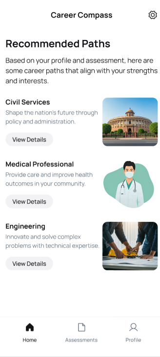

#  Career Compass - AI-Powered Career Guidance App

Career Compass is an AI-powered career guidance engine built for the Indian education system. It analyzes a user's **aptitude**, **skills**, **goals**, and **experience** to provide **personalized career recommendations** using ML & NLP models.

Built with **Kotlin**, **Jetpack Compose**, and integrates external AI APIs to guide users toward the best-suited career paths.
---

## 🔗 Prototype

Check out the interactive UI/UX prototype here:  
👉 [Prototype]([https://www.figma.com/proto/your-prototype-link](https://www.figma.com/proto/kOO5CebE1ZfyhSjcEeiR1Q/AI-assessment-Heckathon---Dibyashree?node-id=5-74&p=f&t=P55Dl89EKmVp24zm-1&scaling=min-zoom&content-scaling=fixed&page-id=0%3A1&starting-point-node-id=5%3A74))

---

## ✨ Features

-  Email/Password & Google Sign-In (Firebase Auth)
-  AI-based Aptitude Estimation via ML
-  NLP-based Goal & Interest Extraction
-  Skill & Experience Mapping using Embeddings
-  Career Suggestions Aligned with Indian Exams (JEE, NEET, UPSC, etc.)
-  Skill Gap Analysis + Learning Recommendations
-  Smart Quiz System (Auto-generated questions)
-  NEP-Aligned Suggestions (per New Education Policy 2020)

---

## 📱 Screenshots

| Login Screen | Dashboard | Assessment | Suggested career path | Skill gap analysis | Profile | 
|--------------|-----------|--------------|--------------------|----------------------|--------|
|  |  |  |  |  | 

---

## 🛠 Tech Stack

- **Kotlin**
- **Jetpack Compose**
- **Firebase Auth**
- **OpenAI API / Cohere / Gemini (for NLP)**
- **Vector Embeddings (for skill mapping)**
- **ML Models** for aptitude/interest prediction

---

